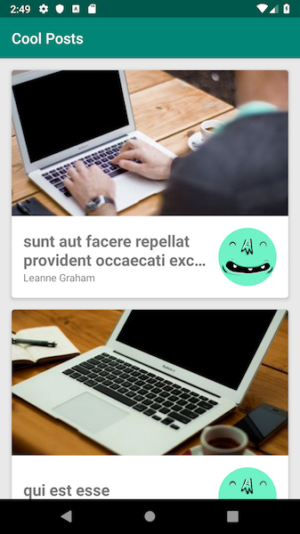
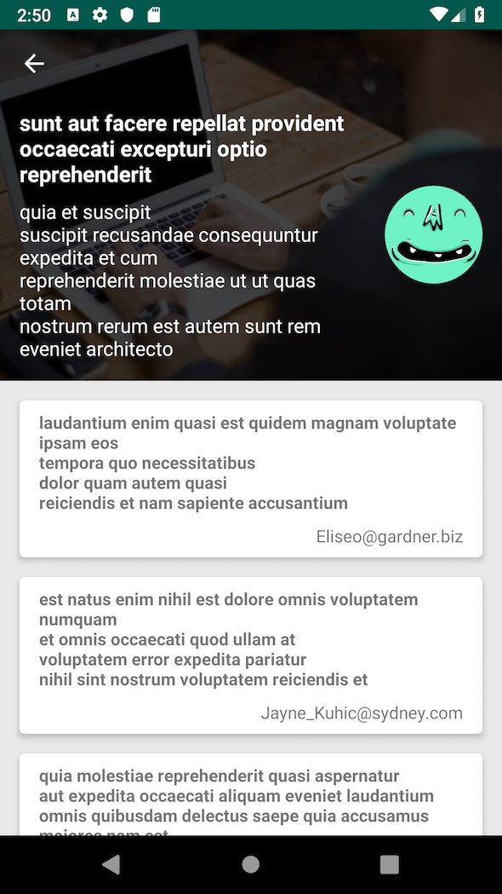
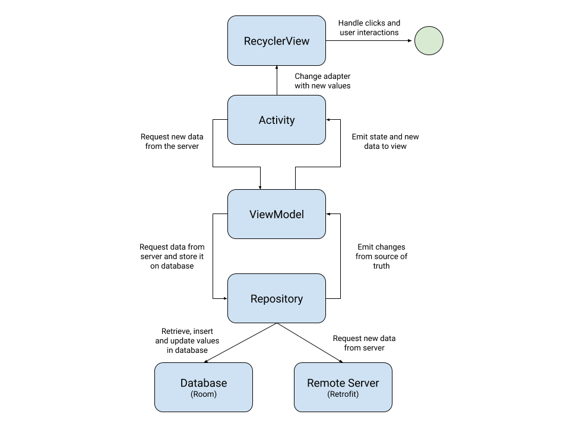
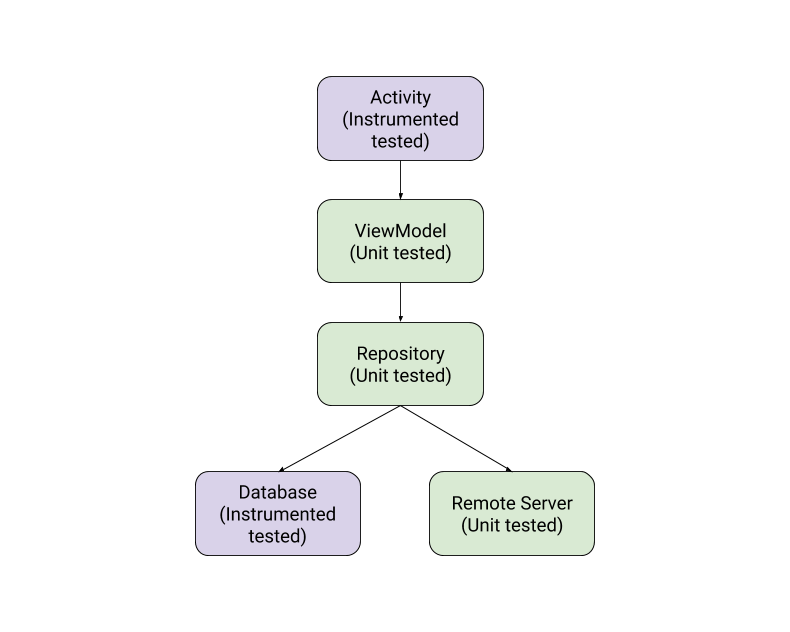
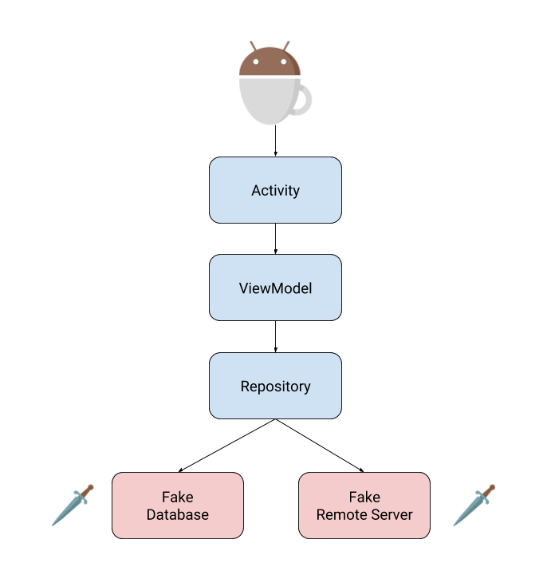

# Cool Posts
This repository consists of an Android project that fetches posts, users and comments from a fake JSON feed and shows it to the user in two screens. One screen is the PostList and the other is the PostDetails.

&nbsp;&nbsp;

## Architecture
This application uses MVVM with Jetpack and follows a strategy of [exposing a view state](https://medium.com/upday-devs/mvvm-rxjava-learnings-1819423f9592) from ViewModel to the View. The codebase is entirely written in Kotlin and uses Dagger 2 for dependency injection. Orientation changes are considered here and by using ViewModel + LiveData the lifecycle of the views is better managed.

In addition, to simplify the flow of data and manage better what the user sees, the concept of [single source of truth](https://developer.android.com/jetpack/docs/guide#persisting_data) is used, where the main source is the Room database which is constantly updated with new values from the Retrofit calls.



## Most important technologies and libraries
* [Kotlin](https://kotlinlang.org/)
* [AndroidX](https://developer.android.com/jetpack/androidx)
* [RxJava2](https://github.com/ReactiveX/RxJava)
* [Dagger 2](https://google.github.io/dagger/)
* [Room](https://developer.android.com/topic/libraries/architecture/room)
* [LiveData](https://developer.android.com/topic/libraries/architecture/livedata)
* [ViewModel](https://developer.android.com/topic/libraries/architecture/viewmodel)
* [Retrofit](https://square.github.io/retrofit/)
* [MockK](https://mockk.io/)
* [Glide](https://github.com/bumptech/glide)
* [JUnit4](https://junit.org/junit4/)
* [Robolectric](http://robolectric.org/)
* [Espresso](https://developer.android.com/training/testing/espresso)
* [MockWebServer](https://github.com/square/okhttp/tree/master/mockwebserver)
* [RESTMock](https://github.com/andrzejchm/RESTMock)

## Remote APIs used
* [JSONPlaceholder](https://jsonplaceholder.typicode.com) - To get Users, Posts and Comments
* [Adorable Avatars](http://avatars.adorable.io/) - To get random avatars to represent users
* [Picsum Photos](https://picsum.photos/) - To get random photos to represent post images

## Testing strategy



## UI test configuration

To configure the UI tests, this project uses the capabilities of Dagger to change the database and remote service at runtime. Although it requires an additional Dagger configuration step in AndroidTest package, it brings some advantages such as:
* Nice level of integration in Activity tests since it uses real ViewModel and Repository implementations
* Once configured, we do not need an additional build flavor or other configuration in our production code, you can execute all tests anytime with a device attached.



## Recommendations to run the project
Opening this project in Android Studio is very straight forward. You just need to have the last stable version of Android Studio installed (3.5.3) and basic dependencies configured (such as the Android SDK). Having this, you just need to import the project, wait for Gradle to sync and finally run it.

To improve productivity, this project has a Makefile with many shortcuts that can be executed in the terminal. For instance, to clear the app data you can execute the following command:
```
make clear-app-data
```

You can also disable the current device animations before running the UI tests by executing this command:
```
make disable-animations
```

Another thing you can do is run all tests (Instrumented and non-instrumented) with a single command:
```
make run-all-tests

or 

make
```

PS: If you would like to use Makefile, be sure to have just one emulator/device running, adb installed in your terminal and the make instruction properly configured :)